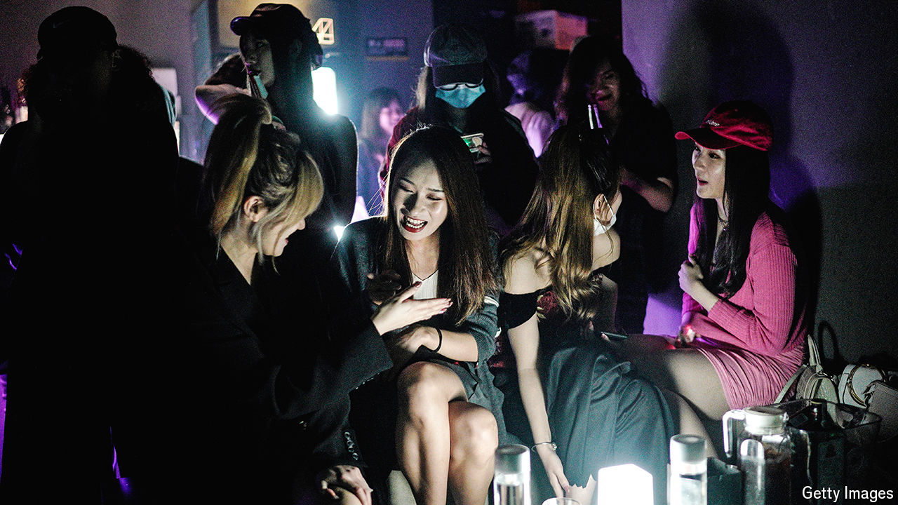

###### The bright side of China

# Watch out Beijing, China’s second-tier cities are on the up 

##### Eight great ones embody growth, optimism and the good life 

 

> Jun 6th 2024 

NEARLY 12m STUDENTS will graduate from Chinese universities this month. Where they go after that is increasingly difficult to predict. For decades graduates were drawn to the same four cities: Beijing, the capital; Shanghai, a financial hub; Shenzhen, a tech centre; and Guangzhou, an export powerhouse. There were opportunities in these places. Their economic heft exceeded that of other Chinese cities. Their public services were better, too. And they were huge, with populations that now range from 13m (Shenzhen) to 26m (Shanghai). As a result, they were dubbed “first-tier” cities. Chinese flocked to them.

Now, though, a large number of graduates are looking beyond the top tier. In recent years China’s lesser-known cities have proved more magnetic. These rising metropolises come from the ranks of the second tier. There are 31 cities on this level, according to the government, which sorts them based on criteria like population and income level. Not all are thriving, but many stand out for their dynamism, culture and quality of life. Some are developing in ways that other Chinese cities might emulate.

