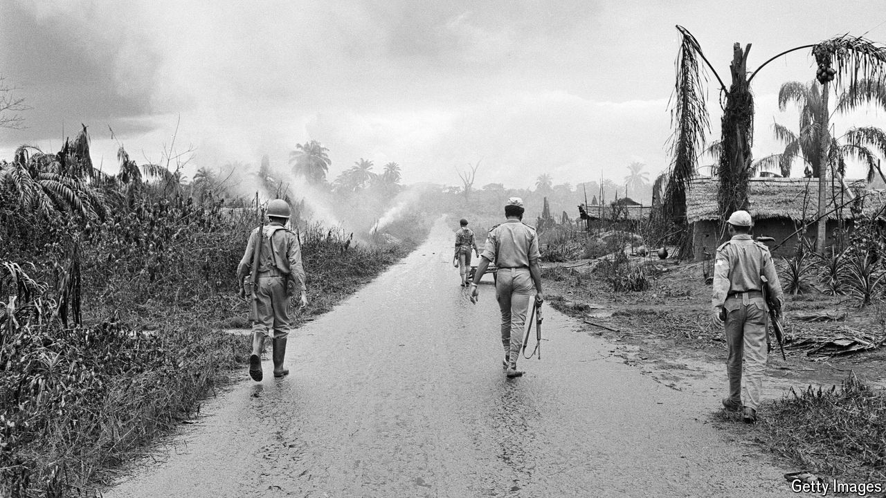

###### Battle lines

# Chigozie Obioma’s visceral novel explores Nigeria’s civil war 

##### The divisions described in “The Road to the Country” have not been reconciled 

 

> Jun 6th 2024 

By Chigozie Obioma. 

NIGERIANS DO NOT speak much of the civil war of 1967-70. Most schools do not teach it in their curriculums. The median age of Nigerians is 17, so only a fraction of the 219m-strong population lived through the conflict. Those that did are often too scarred, or scared, to talk about it for the memories it might prompt. 

