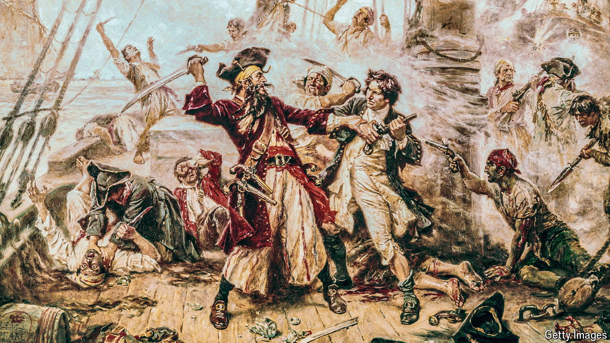

###### Not so Jolly Rogers

# Forget Jack Sparrow and Captain Hook. Piracy is far more fearsome 

##### A riveting new history of aquatic ambushes, from the 1600s to today 

 

> Jun 5th 2024 

By Richard Blakemore. 

THE VERY word “pirate” has a cheery ring. It evokes wooden legs, eyepatches, coins and cutlasses, as well as the likes of Francis Drake, William Kidd, Blackbeard and Henry Morgan. Children’s and adult fantasy is pirate-packed, from Captain Hook in “Peter Pan” to Johnny Depp’s swashbuckling turn as Jack Sparrow in the “Pirates of the Caribbean” films. In Gilbert and Sullivan’s “The Pirates of Penzance”, an opera, the obliging pirates release any captives claiming to be orphans.

