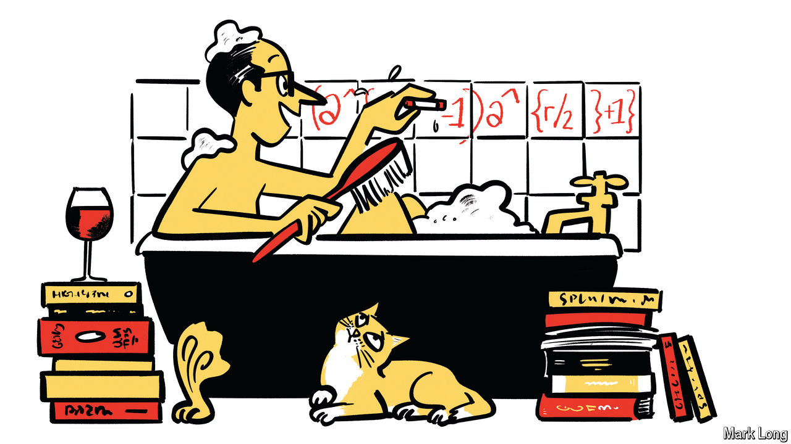

###### Less Bond, more boffin

# How to hire a spy 

##### Puzzles, games and free thinking are key to codebreaking 

 

> Jun 6th 2024 

By Robert Hannigan. 

GEOFFREY TANDY was not sure why he had been summoned for war work in 1939. He was a botanist at the Natural History Museum in London and a friend of , a poet. Bletchley Park, Britain’s codebreaking centre in the second world war, had asked for an expert in cryptograms (encrypted text). Tandy was an expert in cryptogams (algae). Sometimes everything pivots on a consonant. 

