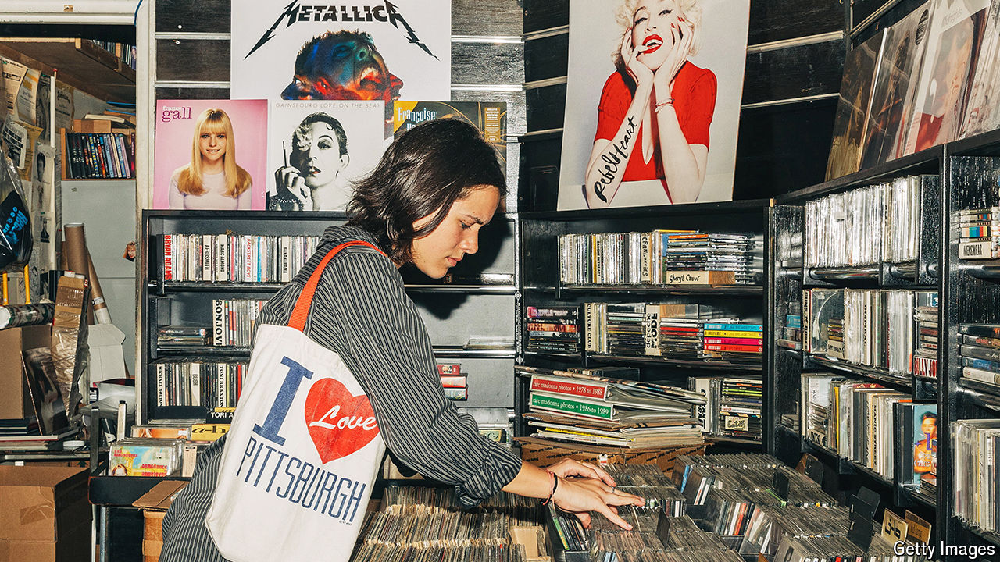

###### Forgoing the single life

# Pop stars are all about albums 

##### Contradictory though it may seem in the streaming era 

 

> Jun 4th 2024 

TO BILLIE EILISH, things like cassettes and CDs probably seem charmingly retro. Born in 2001,  was six years old when Spotify launched; today she is the fourth-most popular artist on the platform.  has only ever known 21st-century listening habits. And yet she has emerged as an unlikely champion of a time-worn format: the album. She declared that her new record, “Hit Me Hard and Soft”, released in May, was a “cohesive” piece of work, “ideally listened to in its entirety from beginning to end”. No singles were released in advance as  for famished fans.

She is not the only hitmaker emphasising the album rather than its component parts. Ariana Grande advertised “Eternal Sunshine”, released in March, with just one single, stressing that she wanted listeners to “experience the album in full this time”. ’s debut album in 2017 was preceded by six singles; she scaled back for her latest record. And  has issued four successive sets of new material with no advance singles. Two of these were “surprise releases”, announced just ahead of their arrival, which again emphasises the primacy of the album format.

