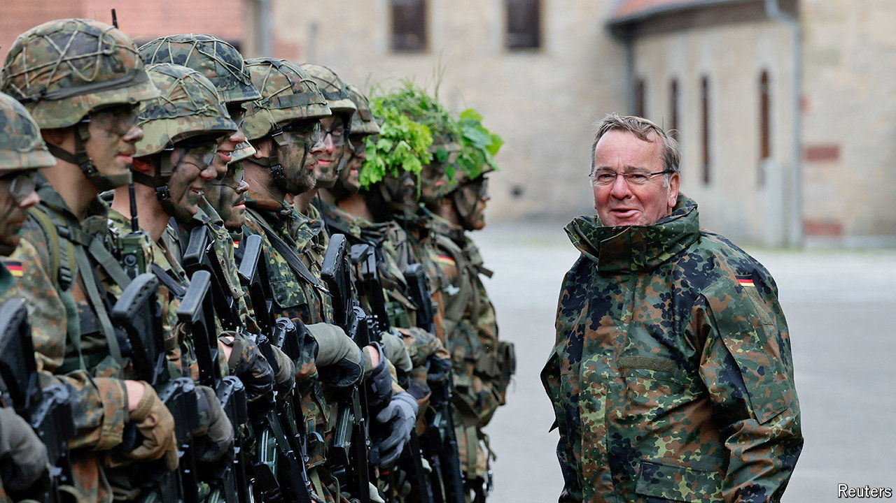

###### Bulking up the Bundeswehr

# Germany is thinking about bringing back conscription 

##### But the chancellor is reluctant 

 

> Jun 6th 2024 

“Kriegstüchtig” does not trip easily off the English tongue. Nor does it fall easily on German ears. Translated roughly as “war-ready”, it is a word deployed by Boris Pistorius, the defence minister, to describe his favoured destination for the long under-resourced Bundeswehr, or armed forces. Money is now pouring in, and Mr Pistorius is overhauling the Bundeswehr’s structures. But like many of its nato allies, Germany is struggling to find enough willing recruits. The minister is among many who want Germany to consider restoring conscription, suspended since 2011, to get the numbers up.

Under plans drawn up in 2018 Germany aims to boost the Bundeswehr to 203,000 troops by 2031, up from around 181,000 today. This is a fraction of the size of the men under arms during the cold war (see chart 1). But the army is ageing and shrinking: given attrition, it needs to recruit 25,000 soldiers a year just to stand still. And Germany’s drum-tight labour market makes it hard for the Bundeswehr to compete with other employers. The situation is “really dire”, says Johann Wadephul, an mp from the opposition Christian Democrats, who back a return to the draft.

