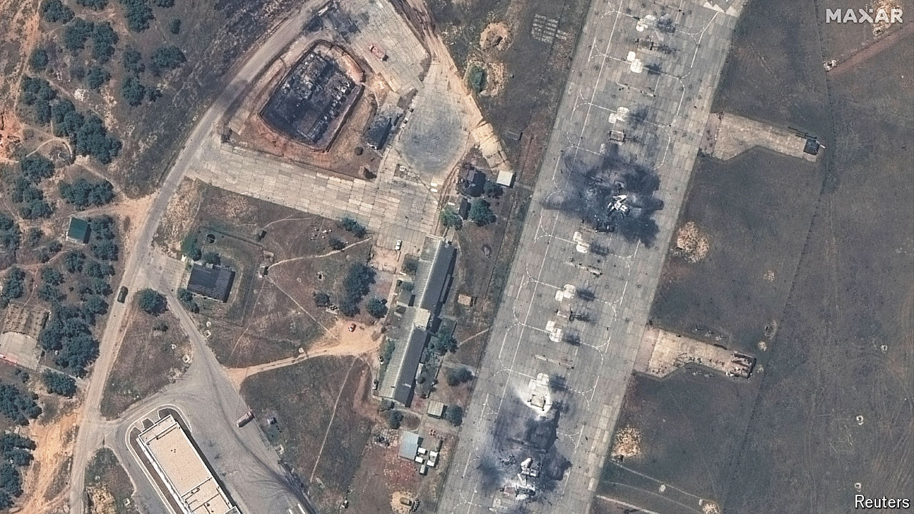

###### The war in the south

# In Crimea, Ukraine is beating Russia 

##### The peninsula is becoming a death trap for the Kremlin’s forces 

 

> Jun 2nd 2024 

GOOD NEWS, at last, from Ukraine. The approval in April of the Biden administration’s , after six months of Congressional delay, is having an impact. In particular, the arrival of , with a range of 300km, means that Ukraine can now hit any target in Russian-occupied Crimea, with deadly effect.

In the past two weeks the Russian offensive in the north-east on , Ukraine’s second city, also appears to have lost momentum. Of potentially even greater significance, on May 30th President Joe Biden, under pressure from a  of European allies, eased the restrictions on American weapons being used against military targets on Russian soil, imposed because of fears of Russian nuclear escalation. The Ukrainians are now to be allowed to use some American kit to hit Russian forces on the other side of the border as they prepare to attack Kharkiv. It is not clear whether this includes Russian tactical aircraft launching glide-bomb attacks like the one that killed at least 18 people in a Kharkiv hardware shop on May 25th.

