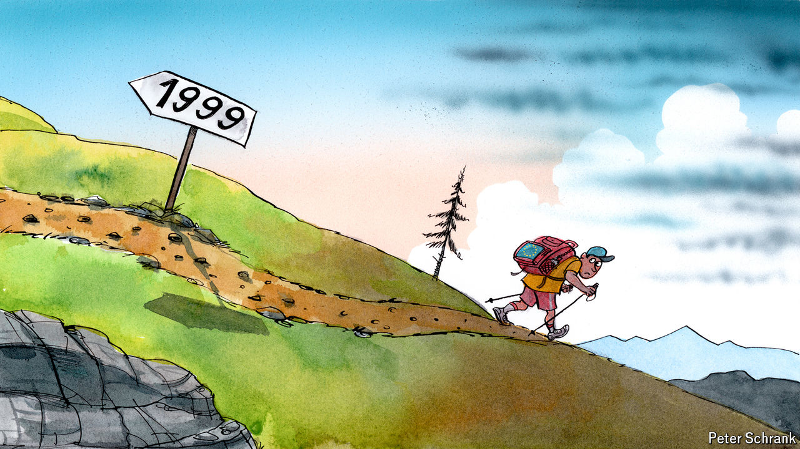

###### Charlemagne

# Peak Europe turns 25: why June 1999 marked the continent’s zenith 

##### Europe had a glorious future, once. What happened? 

 

> Jun 6th 2024 

A nagging feeling is haunting Europe: that it is a continent in decline. Its population will soon be shrinking, if it is not already—for the first time since the plague raged in the Middle Ages. European governments that within living memory ran swathes of the globe, from Algeria to Indonesia, are thankfully now back to merely managing their peninsula. The European economy has been stuck in low gear for so long that it can barely hope to match the growth found in America, let alone in China or India. Euro-optimists insist it is possible to slow this relative decline, with all the confidence of a pensioner hoping to make it through another year without a fall. Gloomier types wonder how long the continent’s perks—a generous welfare system, a degree of global influence, long summer holidays—can be kept up.

To better grasp Europe’s prospects, it pays to consider when it might have reached its zenith. Look too far back, before America took over as global hegemon after the second world war, and Europe’s geopolitical heft comes at the cost of widespread poverty and endless wars. The late 1960s? Fun in swinging London and bohemian Paris, less of it in communist East Berlin or repressive Lisbon. Pick too recent a time and it will be clear the rot had already set in. An anniversary this week caused Charlemagne to ponder his continent’s position 25 years ago. On June 10th 1999 Slobodan Milosevic, Yugoslavia’s strongman, was humiliated into ending his murderous rampage in Kosovo. The short campaign and happy outcome chimed with a period of European political ambition, economic vigour and global clout. It may not have felt like it at the time, but was Peak Europe achieved in June 1999?

