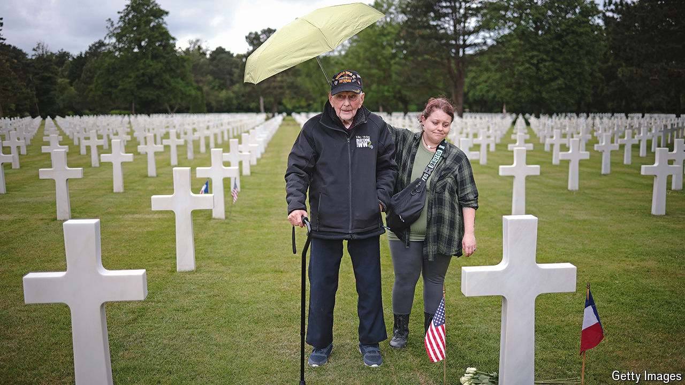

###### D-Day 80 years on

# Remembering the Normandy landings 

##### Thanksgiving in France for the bravery of America and other allies 

 

> Jun 6th 2024 

ALMOST 150 American veterans arrived in Normandy this week, to crowds of French well-wishers waving American and flags. Most of the veterans were in wheelchairs; the oldest was aged 107. All were on their way to the 80th anniversary commemoration of the D-Day landings on June 6th at Omaha Beach. In the presence of America’s Joe Biden and France’s Emmanuel Macron as well as Ukraine’s Volodymyr Zelensky, the event was designed to mark deep French transatlantic gratitude as well as broader allied thanksgiving for the campaign that helped to liberate France from Nazi occupation during the second world war. Eighty years on, the French have not forgotten.

To some American visitors, this is unexpected. “American tourists often ask us whether we really like Americans,” says a French tour-bus driver in Normandy: “They are surprised, because they think we don’t.” In 1966 Charles de Gaulle, founder of the modern French republic, ordered American and allied forces off French soil when he pulled France out of NATO’s integrated military command. French political leaders of all stripes regularly rail against excessive American might. Jean-François Revel, a French writer, once published a book entitled “The Anti-American Obsession”. Even Mr Macron, a political centrist, periodically urges Europe not to become an American “vassal”.

