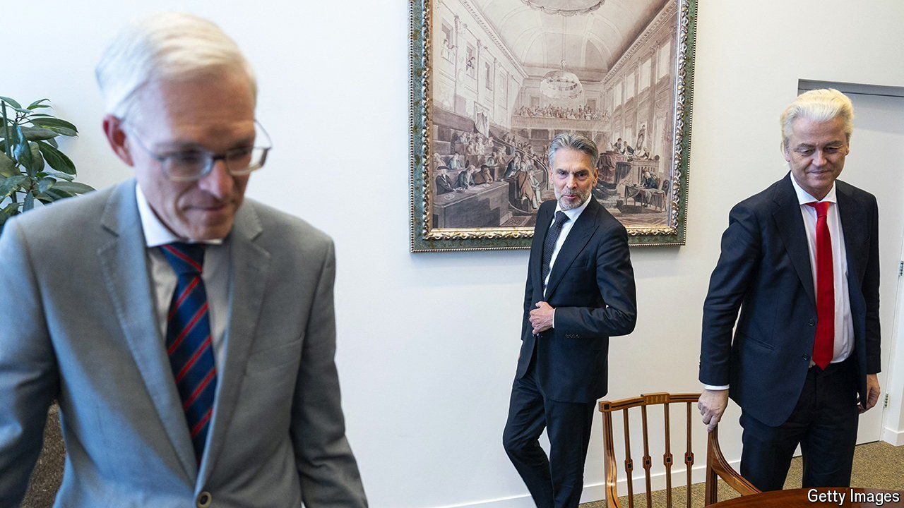

###### Normalising the radicals

# The Dutch are getting a half-populist, half-pragmatist government 

##### A technocrat will be prime minister but the far-right Geert Wilders has the most MPs 

 

> Jun 6th 2024 

The netherlands is a land of long negotiations ( in Dutch). The four right-wing parties that will form the next government have been at it since November, when an election delivered an anti-immigrant landslide, and have spent the past week ironing out who gets which ministry. Three parties are newcomers to government who campaigned on upending The Hague’s staid bureaucratic establishment. But many of their ministers will be establishment types, to judge by their choice of prime minister, announced on May 28th. Dick Schoof is the top civil servant in the justice ministry, an ex-head of the domestic spy agency and erstwhile member of the Labour Party. The fact that the Dutch migrant-bashing populists picked a centrist technocrat to run the country suggests one way Europe is navigating its shift to the hard right.

The talks took so long because the parties mistrust each other. The biggest of the four is the Party for Freedom (PVV), led by Geert Wilders, a nativist rabble-rouser. The PVV was long boycotted by other parties, and its manifesto includes unconstitutional measures such as banning the Koran. That posed a special problem for the third-biggest party, New Social Contract (NSC), a year-old outfit whose founder, Pieter Omtzigt, is a stickler for the rule of law. He spent months ensuring Mr Wilders would respect the constitution.

