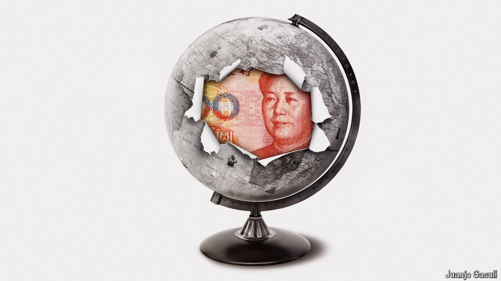

###### Red dawn

# China’s economic model retains a dangerous allure 

##### Despite the country’s current struggles, autocrats elsewhere see a lot to admire 

 

> Jun 3rd 2024 

Twenty years ago Joshua Cooper Ramo, a consultant, first wrote about the “Beijing consensus”. The Washington consensus of financial liberalisation, floating currencies and openness to foreign capital was, he posited, a damaged brand. China was pioneering its own approach to development based on principles of equality, innovation and a relentless focus on sovereignty and national security. This would appeal to lots of developing countries. 

In the years since,  have mostly denied any ambition to export a state-led model of development. But they are sometimes more brazen. Last year, for instance, Xi Jinping argued in a speech to Communist Party officials that the country’s economic model “breaks the myth that modernisation equals Westernisation”, and that its growth was expanding “choices for developing countries”. Leaders past and present in the developing world—from Pakistan’s Imran Khan and Malaysia’s Mahathir Mohamad to Brazil’s Luiz Inácio Lula da Silva and South Africa’s Cyril Ramaphosa—have expounded the benefits of at least some aspects of the model. And since Mr Cooper Ramo first wrote about the Beijing consensus, the Chinese economy has quadrupled in size in real dollar terms, boosting the country’s diplomatic and military sway. 

