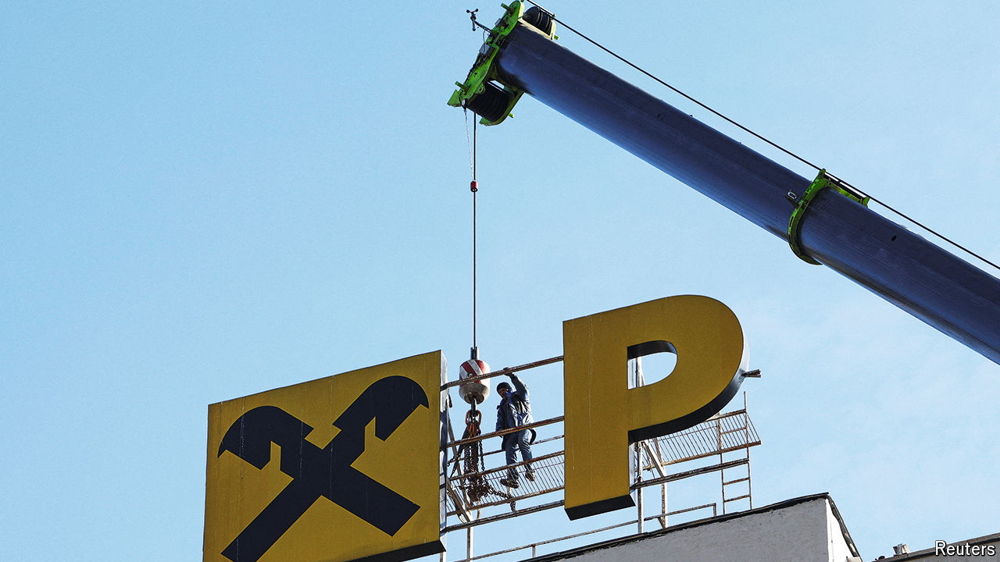

###### Rouble-rousers

# European banks are making heady profits in Russia 

##### But for how much longer? 

 

> Jun 6th 2024 

Days after Vladimir Putin’s invasion of Ukraine, Raiffeisen, an Austrian bank, said it was considering selling its business in Russia. Twenty-seven months later, the lender’s unit in the country is doing rather well. Its staff has grown to nearly 10,000, a 7% rise since 2022. Last year its profit reached €1.8bn ($2bn)—more than any of the bank’s other subsidiaries and a tripling since 2021. Raiffeisen is one of a dozen lenders that Russia deems “systemically” important to its economy. The bank also matters to the Kremlin’s own finances, since it paid the equivalent of half a billion dollars in tax last year. 

Raiffeisen is the biggest Western bank in Russia, but not the only one. The combined profits of the five EU banks with the largest Russian operations have tripled, reaching nearly €3bn in 2023. Success makes the banks a target. In May America threatened to curb Raiffeisen’s access to its financial system because of the bank’s Russian dealings. On June 10th, in an attempt to placate critics, the lender plans to stop making dollar transfers out of the country. Russia, for its part, is starting to seize the assets of Western banks it deems “unfriendly”. Western lenders’ Russian paper profits are at risk of turning to ash.

