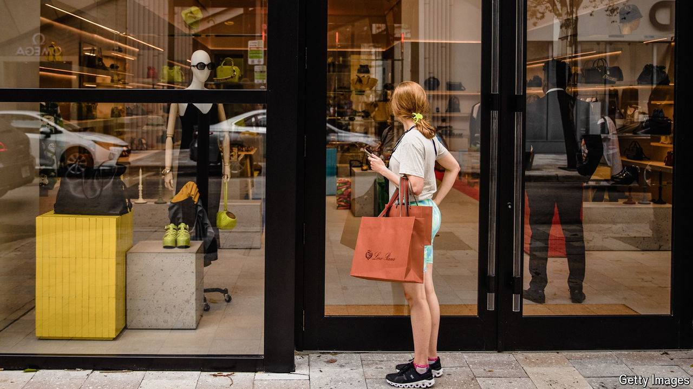

###### No returns

# Is America’s economy heading for a consumer crunch? 

##### Warning signs have started to appear. But there are reasons for optimism 

 

> Jun 4th 2024 

Nothing has been able to stop . At first they splashed covid-19 savings on home-exercise bicycles; now they are more likely to plump for beachside holidays. Predictions made by bank bosses last summer that households would be squeezed by inflation have been confounded. Instead, their outlays have powered American GDP ever higher, at a pace beyond the country’s G7 peers.

But are the predictions at last coming true? Monthly consumer-spending growth fell from 0.7% in March to just 0.2% in April. Overall spending shrank in real terms. Retail sales have weakened, with brands from McDonald’s, a burger purveyor, to 3M, a maker of sticky tape, warning that customers are closing their wallets. The recent spending data, released on May 31st, helped wipe almost a percentage point off the prediction of annual gdp growth from the Atlanta branch of the Federal Reserve, cutting its “nowcast” for the second quarter of the year to 1.8%. 

