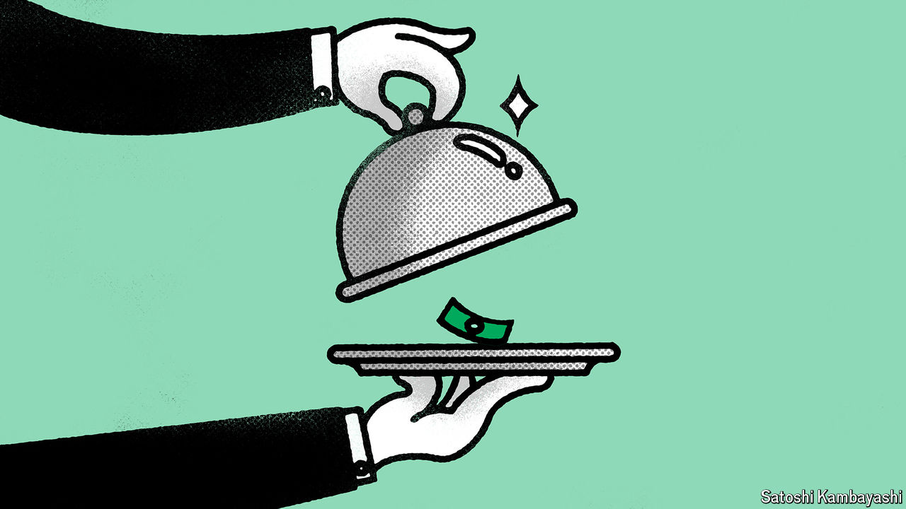

###### Buttonwood

# Should you buy expensive stocks? 

##### A new paper suggests the answer is “yes” 

 

> Jun 5th 2024 

On June 7th each share in Nvidia is due to become many. In one sense such stock splits ought not to matter much: they merely lower the share price, usually returning it to somewhere near $100, in order to make small trades easier. Yet for the company and its longtime backers this administrative exercise is cause to pop the champagne. For a split to be necessary in the first place, the share price must have multiplied, commonly by two or three, prompting each share to be divided by the same factor. Each Nvidia share, however, will become ten. Two years ago both Alphabet and Amazon split each of their shares into 20. Investors in big tech have had plenty of opportunities to let the corks fly.

All three firms have made traditional valuation measures look hopelessly outdated. Dividend yields, for instance, were once a popular tool for assessing prospective returns. But Amazon has never made such a payout and Alphabet will make its first ever on June 17th (of 20 cents per $175 share). Nvidia’s quarterly dividend after the split will be just one cent per share, each priced at around $120. Plainly, there is no stretch of the imagination by which these payouts explain the stocks’ spectacular returns.

