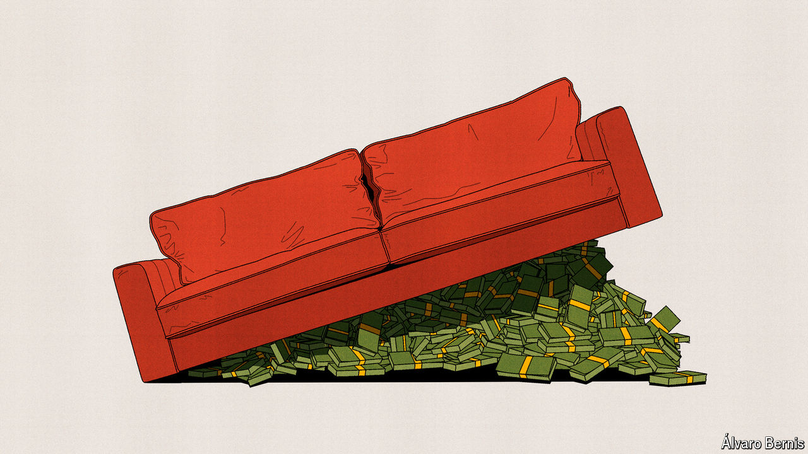

###### Free exchange


# Why global GDP might be $7trn bigger than everyone thought 


##### The discovery has perturbed Chinese officials 

 


> Jun 6th 2024 


Many people have experienced the joy of finding some spare change down the back of the sofa. On May 30th the World Bank experienced something similar, if on a grander scale. After rooting around in 176 countries, it discovered almost $7trn in extra global GDP—equivalent to an extra France and a Mexico. 


In fact, there may be a better analogy. What the World Bank discovered was not additional money to spend, but the equivalent of a discount voucher, which cuts 4% off the price of every good and service the world buys in a year. That means global spending can stretch further than previously thought. 

