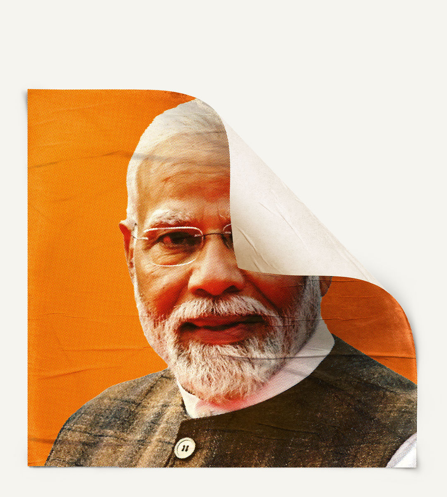

###### The Modi Raj

# A triumph for Indian democracy 

##### The shock election result will change the country—ultimately for the better 

 

> Jun 5th 2024 

The world’s biggest electorate has just shown how democracy can rebuke out-of-touch political elites, limit the concentration of power and change a country’s destiny. After a decade in charge, Narendra Modi was forecast to win a landslide victory in ; yet on June 4th it became clear that his party had l, forcing him to rule through a coalition. The result partially derails the  project to renew India. It will also make politics messier, which has spooked financial markets. And yet it promises to change India for the better. This outcome lowers the risk of the country sliding towards autocracy, buttresses it as a pillar of democracy and, if Mr Modi is willing to adapt, opens a new path to reforms that can sustain its rapid development.

The drama unfolding amid a scorching heatwave begins with the election results. Mr Modi’s Bharatiya Janata Party (bjp) aimed to take up to 370 seats in the 543-member lower house, an even bigger majority than in 2014 or 2019. Instead it won just 240. It lost seats to regional parties in  in Uttar Pradesh and beyond, reflecting a revival of caste-based politics and, it seems, worries about a lack of jobs. Whereas his coalition partners were previously optional extras, he will now rely on them to stay in power. Their loyalty is not guaranteed.

