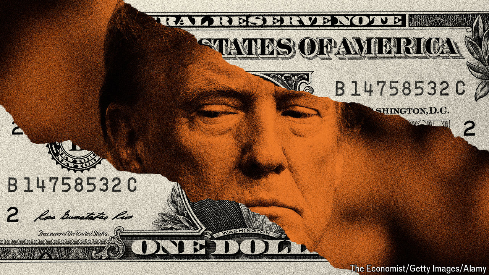

###### Don’t do it

# America’s billionaires should resist the urge to support Donald Trump 

##### A Trump victory would reward them. But not enough to justify the risks 

 

> Jun 6th 2024 

WHEN DONALD TRUMP faces American voters in November he will do so with a band of billionaire backers. Last month Stephen Schwarzman, the chief executive of Blackstone, the world’s largest private-equity firm, said he would support Mr Trump. Miriam Adelson, a casino magnate who sat out the primaries, is expected soon to do the same. Bill Ackman, a hedge-fund manager who has previously donated to Democrats, is said to be edging towards a Trump endorsement. The former president even enjoys increasingly friendly relations with Elon Musk, with whom he once traded insults.

Joe Biden has raised more money overall (though Mr Trump has filled his boots since his conviction in a Manhattan courtroom) and some rich Republicans have yet to decide whom to back. But the former president’s growing support among the wealthy is evidence of his rehabilitation. Business-minded Republican elites had shunned Mr Trump after he tried to overturn the last election result. Today those same people appear to be looking for a reason to set aside their scruples.

