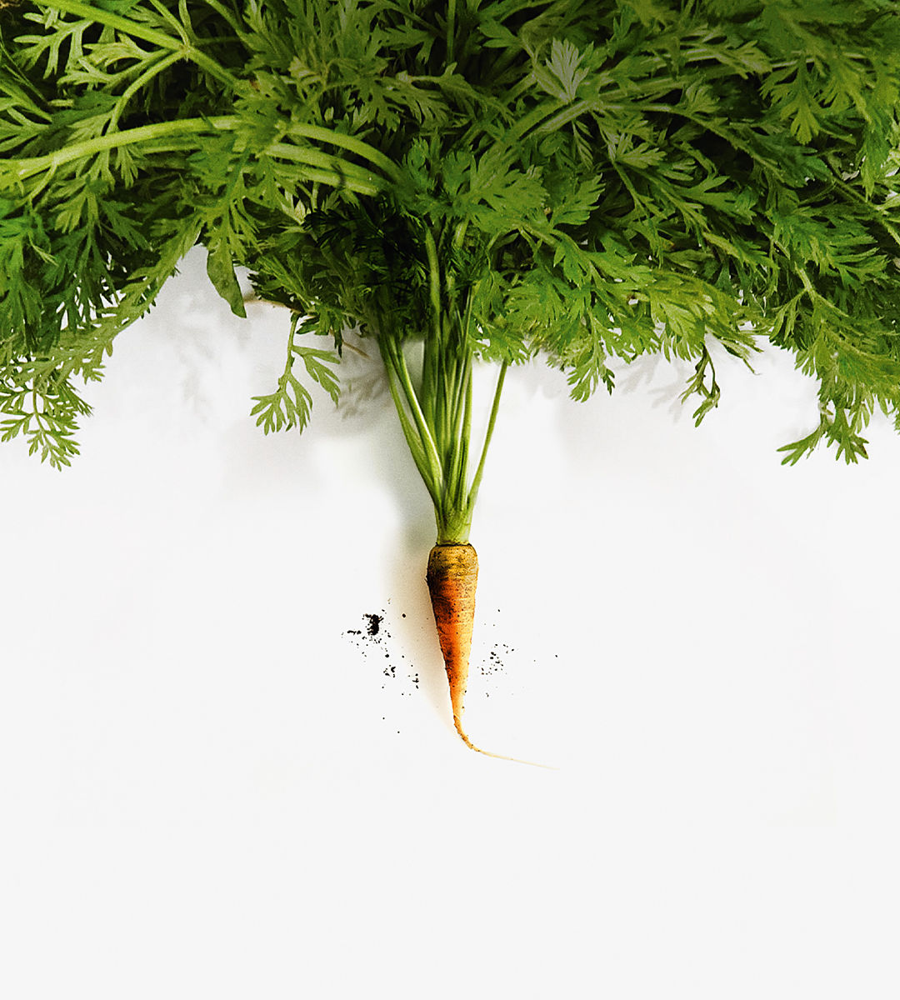

###### Getting growing

# How the Labour Party could end Britain’s stagnation 

##### Even if the economy peps up, taxes will have to rise 

 

> Jun 6th 2024 

STAGNATION IS MISERABLE, as Britain has discovered. The parliament that ended last month may have the unwanted distinction of being the first in at least 60 years to leave the average Briton worse off than when it started in 2019. A repeat of this sorry feat over the next term is unlikely: the country would be unlucky to face blows to rival the impact of Brexit, covid-19 and the Russian energy shock. Inflation is falling; interest rates should soon start to come down. But doing a little bit better is not enough for Britons, or their .


