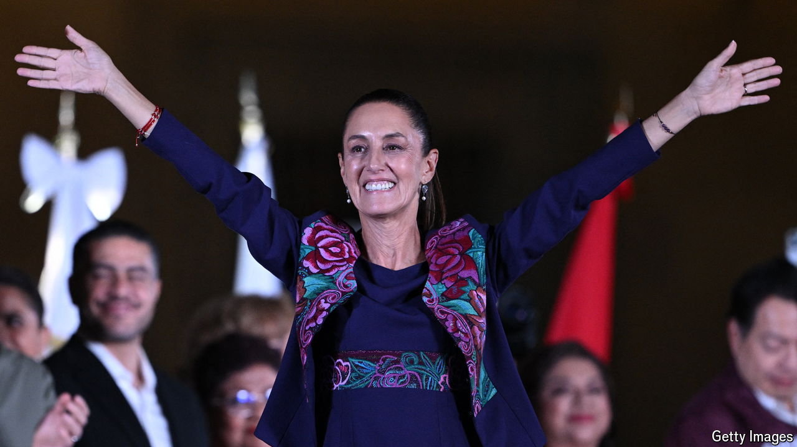

###### Single-party politics

# Morena’s landslide win threatens to take Mexico down a dangerous path 

##### The country’s newly elected president will need to show political courage 

 

> Jun 6th 2024 

Mexicans know the dangers of one-party rule. In 2000 the country emerged from seven decades under the Institutional Revolutionary Party (PRI), which were defined by corruption, inequality and political repression. Yet in  they voted to hand the ruling party, Morena, a degree of power not seen since the PRI’s fall. Morena and its coalition allies are less disciplined and monolithic than the PRI was, but they still pose a grave threat to Mexico. Much now turns on the political courage of the country’s next president, Claudia Sheinbaum, the first woman to hold the post.

The fact that Ms Sheinbaum won the presidency was not a surprise. She had enjoyed a 20-point lead in the polls for months, buoyed up by the valuable support of Andrés Manuel López Obrador, the outgoing president. But few expected Morena to be so dominant. The ruling coalition is likely to control between 346 and 380 of the 500 seats in the lower house, a supermajority that enables it to amend the constitution. In the upper house it has at least 82 of 128 seats, three shy of a supermajority (which it will probably gain thanks to a few “grasshoppers”, as Mexicans call lawmakers who switch parties). Morena’s coalition also now runs 24 of 32 governorships and has supermajorities in at least 22 of the 32 state congresses.

