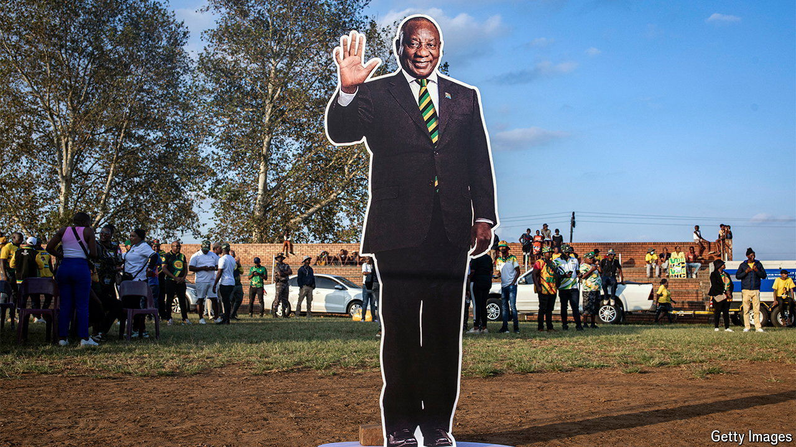

###### The humiliation of the ANC

# South Africa stands on the brink of salvation—or catastrophe 

##### To prevent a coalition of chaos, Cyril Ramaphosa and the Democratic Alliance must do a deal 

 

> Jun 1st 2024 

SOUTH AFRICA is seeing the biggest shake-up in its politics in the 30 years since the end of apartheid. The African National Congress (ANC), which has governed since 1994, has been . Given the ANC’s record of corruption, rotten governance, economic stagnation and rising unemployment, the country should be celebrating. Instead it is anxiously awaiting the results of backroom negotiations that will determine which path South Africa takes. The stakes could not be higher. One fork leads to the certain prospect of reckless populism, venality and economic crisis. The other to pragmatism and the hope of renewal.

The ANC, which once commanded the support of almost 70% of the electorate, has been in stunned into shock since voting took place on May 29th. Party insiders thought it might lose its majority for the first time, but even they expected it to do so by just a few percentage points. Instead it limped in with 40.2% of the vote, a humiliating 17-point drop since the previous national elections in 2019. 

