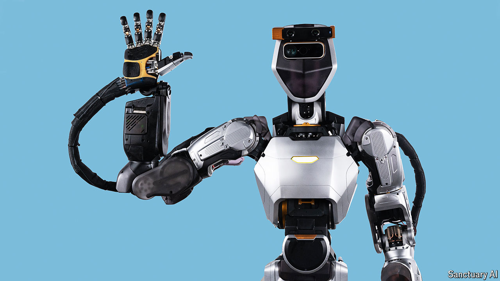

###### From chatbots to robots

# Three reasons why it’s good news that robots are getting smarter 

##### They are becoming more capable, easier to program and better at explaining themselves 

 

> Jun 6th 2024 

THE ROBOTS are coming! In science fiction that is usually an ominous warning. In the real world, it is a prediction—and a welcome one. The field of robotics has made impressive progress in the past year, as researchers in universities and industry have applied advances in artificial intelligence (AI) to machines. The same technology that enables chatbots like ChatGPT to hold conversations, or systems like DALL-E to create realistic-looking images from text descriptions, can give robots of all kinds a dramatic brain upgrade. 

As a result, , easier to program and able to explain what they are doing. Investors are piling into robotics startups. OpenAI, the creator of ChatGPT, which gave up on robots a few years ago, has changed its mind and started hiring a new robotics team. When brought to bear upon the physical world, previously disembodied AI now appears to have enormous potential.

