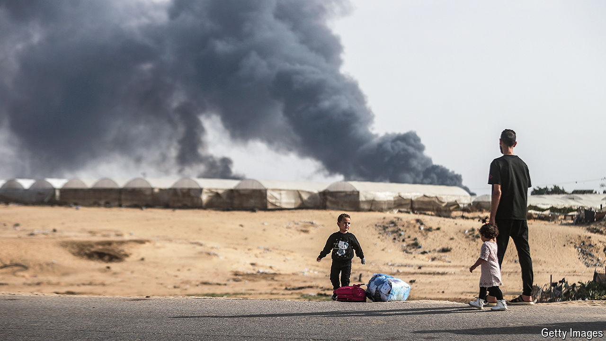

###### An Israeli ceasefire proposal

# Joe Biden leaked Israel’s first plan to end the war in Gaza 

##### But hardliners in Israel and Hamas may yet scupper it 

 

> Jun 6th 2024 

The timing of Joe Biden’s speech on May 31st seemed deliberate. It was broadcast on Friday, shortly after sundown in Jerusalem. Israeli cabinet ministers from the religious right would be off their phones and unable to make public statements because the Sabbath had begun. The American president chose this moment to reveal an Israeli proposal to Hamas, the militant group, for what he described as “a road map to an enduring ceasefire and the release of all hostages”.

Israel’s leaders did not approve the leak, but they knew it was coming. Binyamin Netanyahu, the prime minister, grudgingly admitted that the plan was of his government’s own making. It is Israel’s first official outline for ending the war in Gaza.

