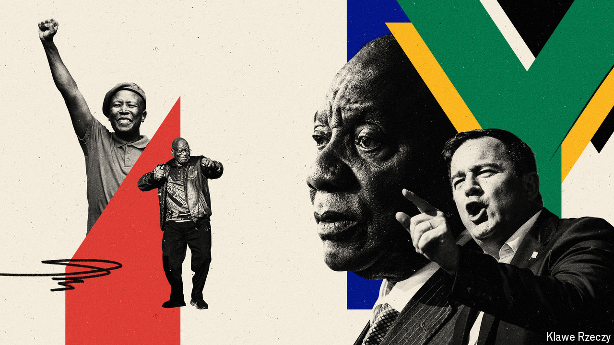

###### Long talk to freedom

# South Africa’s future is in the hands of a divided ANC 

##### The party is debating whether to embrace populism or pragmatism 

 

> Jun 6th 2024 

Meetings of the African National Congress (ANC) are a mix of materialism and narcissism. The fancy SUVs parked outside any gathering hint at the spoils of office enjoyed by South Africa’s ruling party. Inside there will be a selfindulgent atmosphere: regalia and songs that hark back to the anti-apartheid struggle; discussion about the meaning of transformation, liberation, revolution and renewal. There are few things that the ANC enjoys more than talking about the ANC. There is enough navel-gazing to require an army of chiropractors.

How the ANC sees itself—and its self-interest—will determine the future of South Africa. On June 2nd electoral officials announced that Africa’s oldest liberation movement had taken a licking at the election four days earlier. The ANC won 40.2% of the vote, down from 57.5% in 2019. It has until June 16th—the deadline for parliament to elect a president—to cut a deal to stay in power. On June 5th an ANC spokesperson said the party had approached all the major opposition parties and sought a “government of national unity”. But in the end it will almost certainly have to make a choice. It will need to decide whether to lean towards pragmatism, by working with the main opposition party, the Democratic Alliance (DA), which came second with 21.8%—or to team up with a dangerous populist party. 

