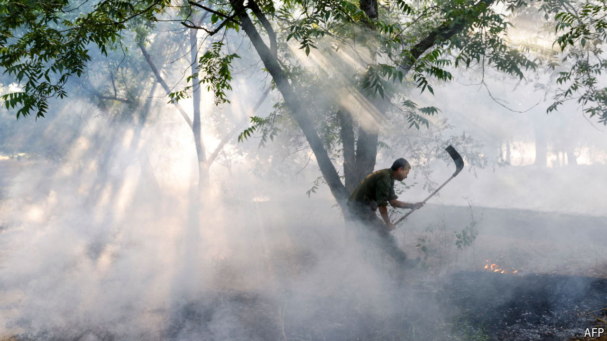

###### One step closer

# Talk of war between Israel and Lebanon is growing 

##### Israel and Hizbullah would still prefer to avoid one, but that is getting ever harder to do 

 

> Jun 5th 2024 

SUMMER wildfires are common in northern Israel and southern Lebanon. But war, not weather, brought them early this year. Rocket and drone attacks by Hizbullah, the Lebanese Shia militia, sparked wildfires that have burned more than 3,700 acres in northern Israel and the Golan Heights. In Lebanon, meanwhile, Israeli shelling set fire to forests near the border.

Israel and Hizbullah have kept up a low-intensity conflict since October, when the Lebanese group started firing rockets in support of Hamas in Gaza. Over recent weeks, however, that conflict has escalated. Since October  has used a NASA satellite designed to detect forest fires and a machine-learning model to track war-related fires near the border. The model detected a spike of activity beginning in mid-May; on June 2nd it logged the worst day since late October (see chart).

