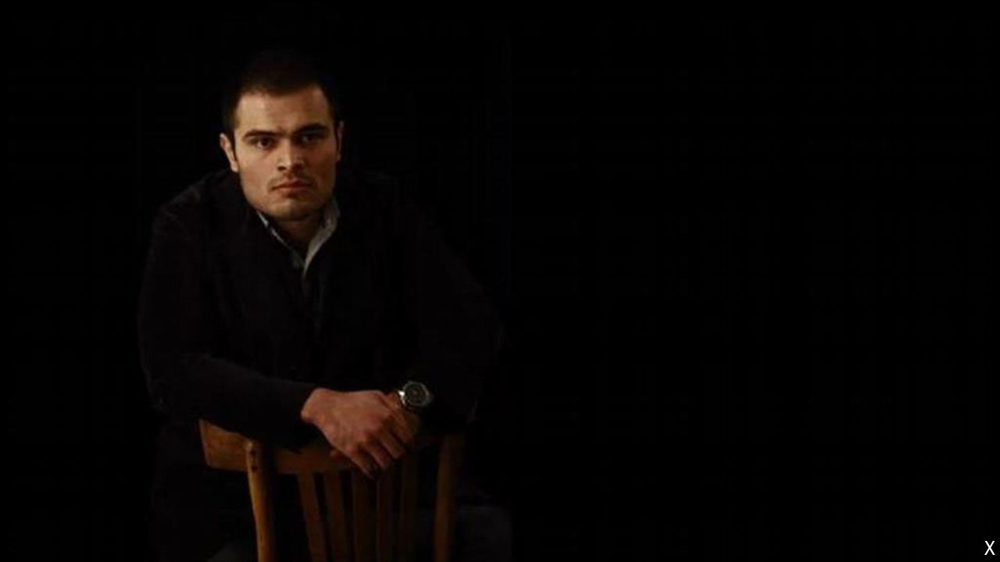

###### The lure of the Great Satan

# The children of Iran’s revolution still want to go West 

##### Some go to undermine the Islamic Republic; others to boost it 

 

> Jun 6th 2024 

Growing up, Iran’s , the children of the elite, chanted death to America each morning at school. But as soon as they had finished their education, they set off in search of the American dream. Iran touts its pivot to Russia and China, but the  of the Islamic Republic still want to go West.

Among them are close relatives of two of the front-runners in Iran’s presidential election on June 28th, Ali Larijani and Mohammad Qalibaf. They have settled in Britain and Canada. The supreme leader, Ayatollah Ali Khamenei, has several family members in Britain and France, including his nephew, Mahmoud Moradkhani. Grandchildren of the founder of the Islamic revolution, Ayatollah Ruhollah Khomeini, have settled in Canada. According to one outraged former minister, 5,000  live in America, the Great Satan, alone. 

