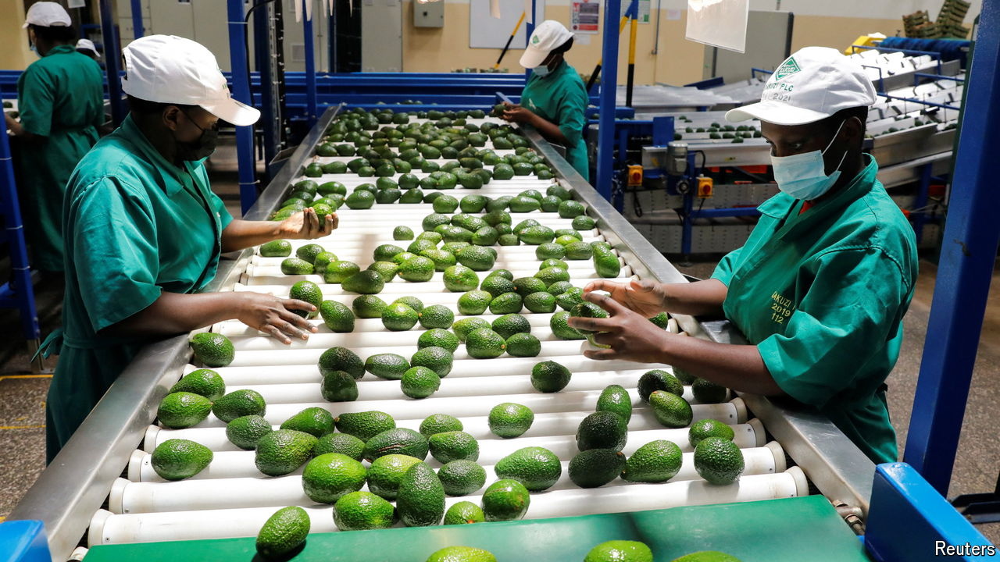

###### Avocado paradise

# Why avocados are driving another sort of green economy in Kenya 

##### A clement climate at high altitudes and an entrepreneurial spirit are giving Kenyans a fruitful future 

 

> Jun 6th 2024 

Look beyond the lions and elephants. Resist the cups of coffee and tea. Hail instead Kenya’s latest success story: the firm but luscious avocado pear, now climbing up the list of Kenya’s exports. Already the biggest African avo-exporter, well ahead of South Africa, Kenya has been expanding its sales to Europe and is trying to push into the mass markets of India and China. “We are number five [in the world] in avocado exports and can easily get to number one,” says Simon Chelugui, Kenya’s minister for co-operatives. 

Mr Chelugui may be behind the times. According to the latest estimate of the UN’s Food and Agriculture Organisation (FAO), Kenya reached number three in exports last year. It is still far behind Mexico, the unchallenged giant, and Peru, the runner-up. But the volume of Kenya’s exports shot up last year by 24%, the steepest climb of any big producer. 

