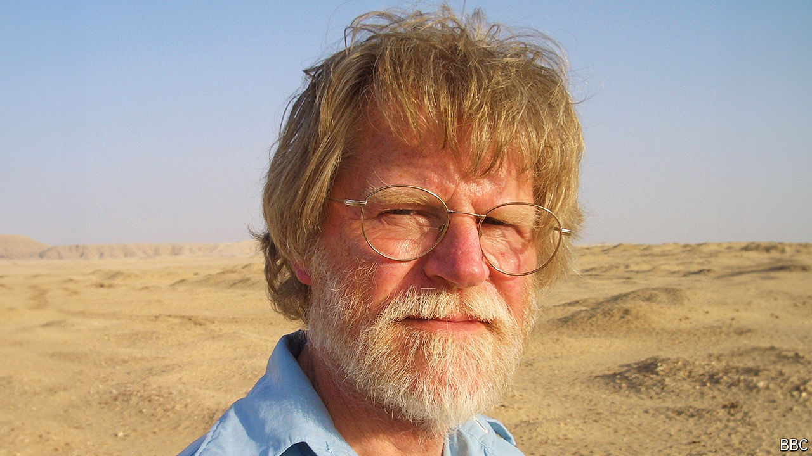

###### Unearthing ancient mysteries

# Barry Kemp spent his career digging up Akhenaten’s abandoned city 

##### The eminent Egyptologist died on May 15th, aged 84 

 

> Jun 6th 2024 

For more than four decades Barry Kemp lectured and taught at Cambridge University. But for almost all that time his mind, and preferably his body too, were elsewhere. Cambridge is a well-watered place of meadows and college greens; Professor Kemp, with the tan, full beard and far-seeing eyes of an explorer, was walking in the pale red sand of Egypt’s eastern desert. In Cambridge, noble old buildings surrounded him. In the city that filled his thoughts, Amarna, 200 miles south of Cairo, little was left but low mounds and remnants of walls. In between writing the core text for Egyptology courses, a primer on hieroglyphs and a guide to “The Book of the Dead”, he ceaselessly searched that tract of land for what had once been there.

Amarna had been dreamed up by Akhenaten, a radical among Egypt’s pharoahs. He said he had been led to the site by the Aten, the disc of the sun, whose cult as a single divinity he had established in place of Egypt’s myriad gods. The site lay to the east, facing tall cliffs through which the sun rose. Around 1344bc Akhenaten began to build a new city there. Temples, administrative buildings, warehouses and worker dwellings went up at breakneck speed. The pharoah ordered 20,000 people to move in; they found themselves on a bleak desert bluff above the Nile, with little drinkable water and where few crops could grow. Since he was absolute, no one had dared to tell Akhenaten that this was a bad idea. After 20 years the city was abandoned. For the next 31 centuries wind, sand and plunderers took it over.

