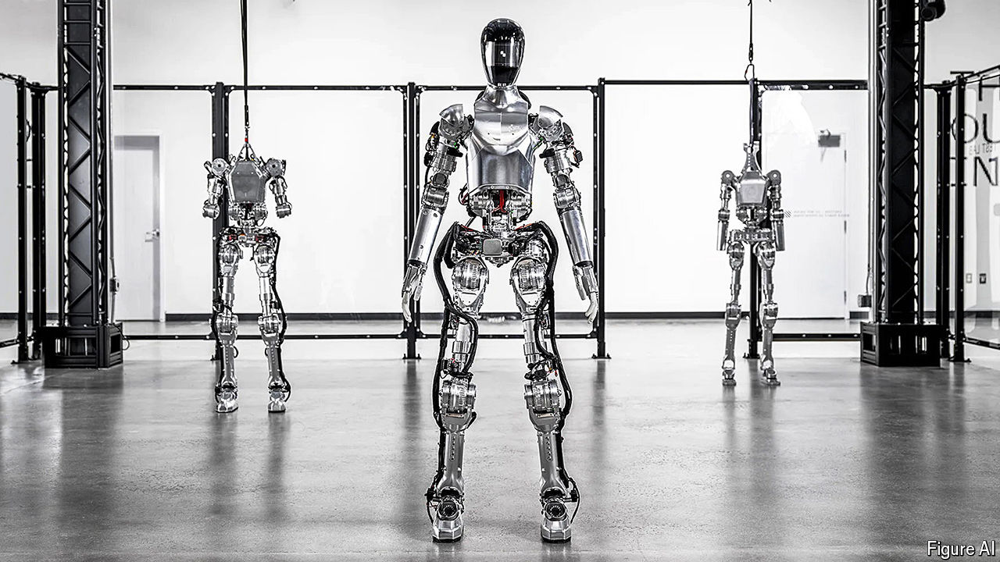

###### Robotics

# Robots are suddenly getting cleverer. What’s changed? 

##### There is more to AI than ChatGPT 

 

> Jun 5th 2024 

“WHAT DO YOU see right now?” a man asks a humanoid robot standing behind a table. “I see a red apple on a plate in the centre of the table, a drying rack with cups and a plate, and you standing nearby, with your hand on the table,” the robot replies. “Great—can I have something to eat?” says the man. “Sure thing,” says the robot. It flexes its arms, picks up the apple with its right hand, passes it to its left hand, and then hands it to the man. He asks the robot to explain its actions. “So I gave you the apple, because it’s the only, er, edible item I could provide you with from the table,” it replies.

This demonstration, shown in a video released by Figure, a robotics startup, in March, caused widespread amazement. It shows a robot that can hold spoken conversations, recognise and manipulate objects, solve problems and explain its actions. And Figure is not alone in producing such impressive results. After years of slow progress, robots suddenly seem to be getting a lot cleverer. What changed? 

