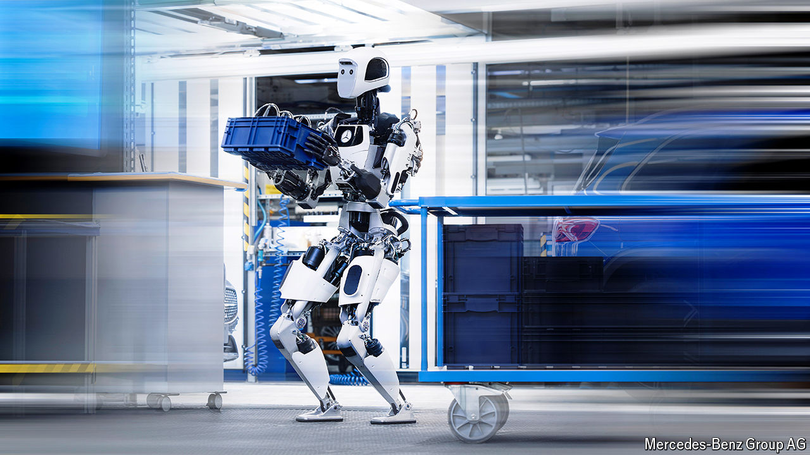

###### Two legs good

# The quest to build robots that look and behave like humans 

##### The engineering challenges involved are fiendish, but worth tackling 

 

> Jun 5th 2024 

IF THE CANON of science-fiction cinema is in broad agreement on one thing, it is that a robot is supposed to look like a human being. It is not only casting directors and special-effects technicians who are on board: engineers can also see the appeal. Pras Velagapudi, the chief technology officer at Agility Robotics, a firm based in Oregon, says that the human form has “guaranteed versatility” because it can be adapted for a wide range of applications. Small wonder. After all, robots have to navigate an environment that has been shaped by humans to suit their needs.

Such humanoid robots are now starting to work in the real world. Amazon, an e-commerce giant, is testing Digit, a robot made by Agility, in helping its warehouse employees with repetitive tasks. Close to two metres tall, with skinny bird legs and a flat tubular head, Digit can carry empty yellow bins from a shelf to a nearby conveyor belt. Boston Dynamics, a Massachusetts-based robotics firm, plans to use its latest humanoid robot, Atlas, in the manufacturing operations of its owner, Hyundai, a South Korean carmaker. 

