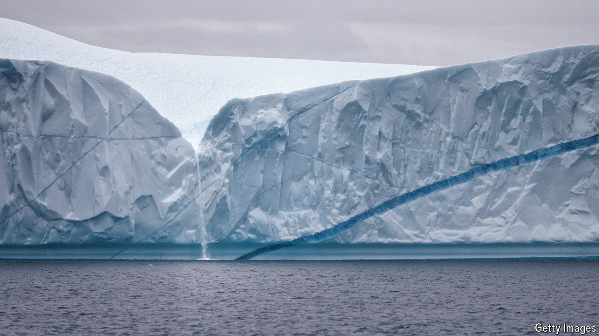

###### On thin ice

# Zany ideas to slow polar melting are gathering momentum 

##### Giant curtains to keep warm water away from glaciers strike some as too risky 

 

> Jun 6th 2024 

Globally, sea levels have risen by somewhere between 21cm and 24cm since 1880. Most of this rise is a consequence of water physically expanding as it warms, but in recent decades meltwater flowing off Greenland and Antarctica has significantly contributed too.

These rises in sea levels threaten coastal properties and the livelihoods and lifestyles of coastal communities, as well as the very existence of low-lying countries. Rising seas not only erode or flood land, they also let destructive storms reach ever farther inland. As melting polar ice becomes an ever more important contributor to sea-level rise, some have begun to embrace the notion that it could be slowed by technological means ranging from underwater curtains to ice-thickening pumps.

