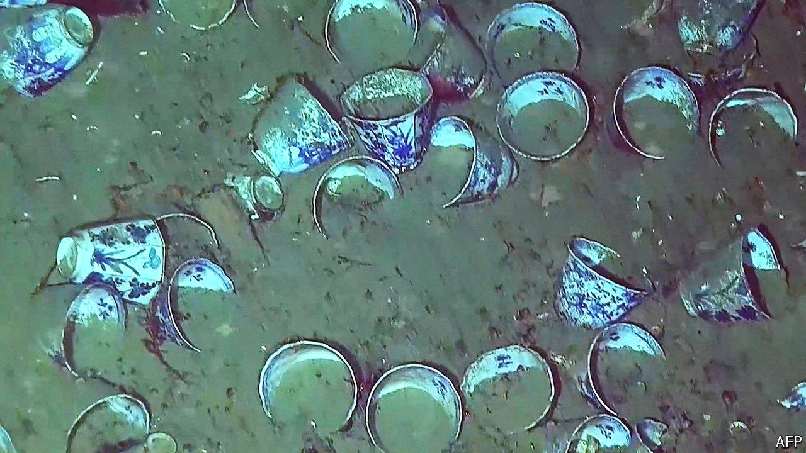

###### Going for gold

# A battle royal over deep-sea archaeology in the Caribbean 

##### Colombia begins to explore one of the world’s most contested shipwrecks 

 

> Jun 6th 2024 

The San José was sailing for Cartagena, on Colombia’s Caribbean coast, when in 1708 a squadron of British warships set upon the galleon and she sank. She was carrying riches gathered in the New World back to Spain to fund its war of succession: emeralds, porcelain of the Qing dynasty, gold coins and silver from Potosí, modern-day Bolivia. With a present-day value estimated at many billions of dollars, the is the world’s most valuable wreck.

Colombia’s navy found it in 2015 with the help of a firm called Maritime Archaeology Consultants. The discovery prompted a bitter row over the wreck’s ownership. Colombia says the ship is protected as an “inalienable item of cultural interest” because it lies in its territorial waters. Spain argues that it owns the vessel because international law recognises a wreck like the  as the property of the state whose flag it flew. The Qhara Qhara, an indigenous Bolivian group, says the precious metals on board came from their land, a claim that Colombia’s president, Gustavo Petro, acknowledged last year.

