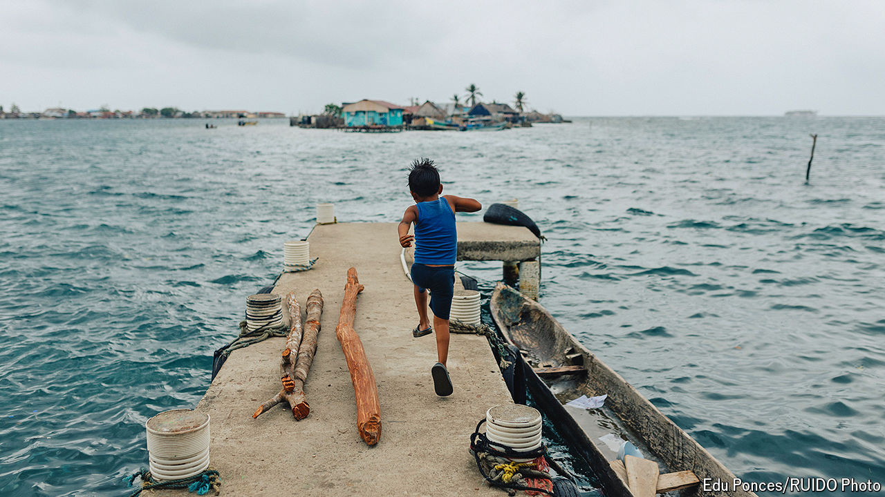

###### Climate migration

# As seas rise, the relocation of Caribbean islanders has begun 

##### The government-managed movement of 300 families from the island of Gardi Sugdub is a test case for “planned retreat” in Latin America 

 

> Jun 4th 2024 

Under a light Caribbean drizzle, volunteers load plastic chairs, a chest of drawers and a gas stove into a military motorboat. On board, men in uniform help an indigenous woman dressed in the traditional green-and-red blouse of the Guna people to step down from the wharf.

She is, or was, a resident of Gardi Sugdub, a tiny coral island about a kilometre off the northern coast of Panama. On June 3rd the Panamanian government began moving 300 families from the island to new government-built housing on the mainland. A changing climate and rising seas are slowly swamping the island, and 37 other inhabited islands nearby, most of which lie less than one metre above sea level. That level is rising 3.4 millimetres every year. Storms are becoming heavier and more frequent. Steve Paton of the Smithsonian Tropical Research Institute in Panama City says the islands will be uninhabitable by the end of the century. 

