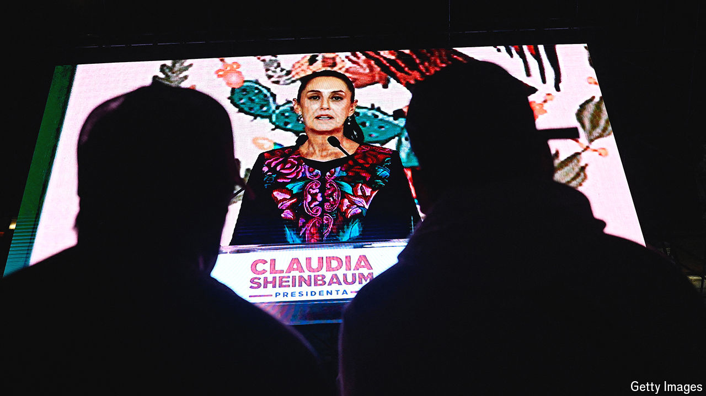

###### Mexico’s new president

# Claudia Sheinbaum’s landslide victory is a danger for Mexico 

##### She has huge power, but faces huge challenges 

 

> Jun 6th 2024 

Few doubted that Claudia Sheinbaum would win Mexico’s election on June 2nd, and become the country’s first female president. But the landslide voters delivered for her and Morena, the ruling party, surpassed expectations. She got at least 58% of the vote, a share larger than that won in 2018 by her predecessor, Andrés Manuel López Obrador. Morena’s coalition will almost certainly obtain a supermajority in Congress. This spells danger: even before she takes office on October 1st, her ruling party will be able to shape Mexico, even by altering the constitution. 

The thumping win is thanks in part to Morena’s redistributive policies, a combination of cash transfers and constant rises in the minimum wage. Ms Sheinbaum’s share of the vote was higher in poorer parts of the country, though she prevailed in all but one of Mexico’s 32 states. “I don’t receive anything but I am happy that students, old people and people of limited means have support,” says Miriam Salazar, a 42-year-old architect in Mexico City. 

