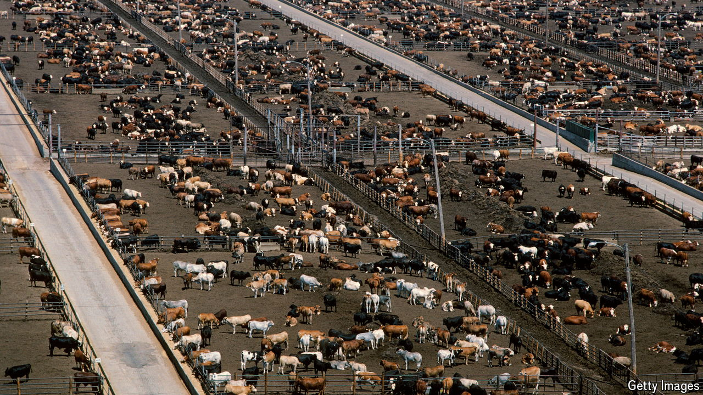

###### The Economist explains

# How lab-grown meat became part of America’s culture wars 

##### Conservatives have beef with petri-dish steaks 

 

> Jun 3rd 2024 

THERE IS A political parable that begins with two cows. Communists would give both to the government; capitalists would sell one and buy a bull. Were it to be set in America today, Republicans would worry that their cows could be rendered obsolete. On May 1st Ron DeSantis, Florida’s governor, banned the sale of  in his state, an attempt, he said, to “save our steaks”. Alabama has passed a similar law; Arizona and Tennessee are considering doing the same. Some 13 other red states prohibit firms from labelling their lab-grown meat with  to real animal products. Why are Republicans so worried about “fake” meat? 

In June 2023 the US Food and Drug Administration granted permission for several companies to sell lab-grown meat, making America the second country, after , to allow the stuff. On a cellular level, cultivated meat is identical to its conventional counterpart. Animal cells are grown in a tank filled with nutrient-rich liquid, or on a scaffold made out of biomaterials such as synthetic polymers, to encourage structure. Most such products are, for now, prohibitively expensive. So far they have not appeared on a single supermarket shelf in America. Two restaurants in San Francisco and in Washington, DC, have served lab-grown meat, though it is currently off the menu at both eateries. If it becomes more popular, lab-grown meat might help reduce the environmental impact of livestock farming, which accounts for around 12% of greenhouse-gas emissions worldwide. 

