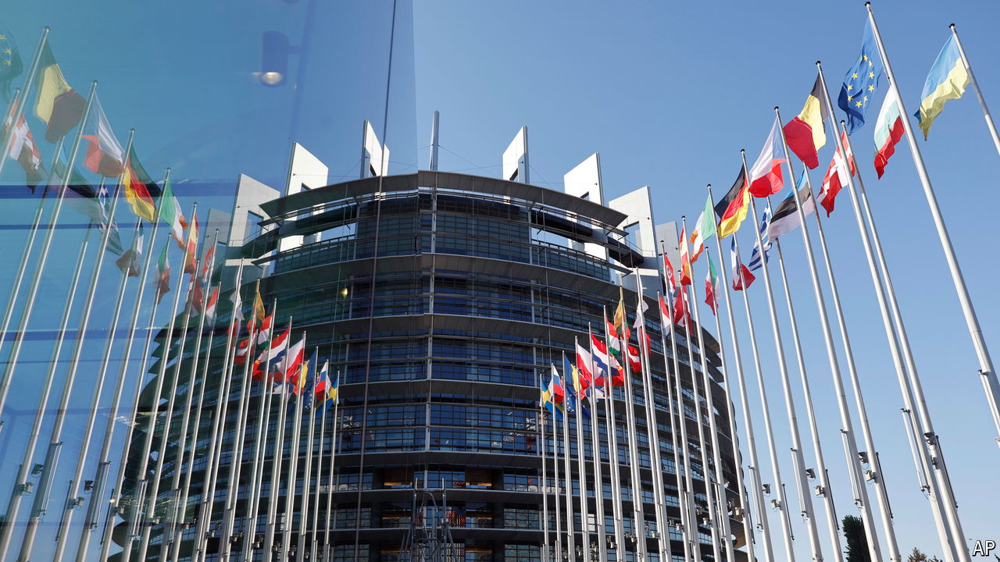

###### The Economist explains

# How powerful is the European Parliament? 

##### Upcoming elections show its growing clout 

 

> Jun 5th 2024 

BETWEEN JUNE 6TH and 9th the European Union will hold an election for the European Parliament. The chamber has long had a reputation for toothlessness: critics have derided it as a “paper tiger” and a “Mickey Mouse” assembly. Most attempts to enact change, they say, get tangled in red tape. Yet the European Parliament has gradually become more powerful since its inception as a directly elected chamber in 1979. The outcome of the election will help to determine how the EU tackles a range of geopolitical problems, from the war in Ukraine to climate change. How does the parliament work and why does it matter?

The European Parliament has a complex structure. Voters in member countries elect an MEP for their constituency: dozens of national and European parties are represented. Many of them join a continental political group, of which there are currently seven. The biggest is the centre-right European People’s Party (EPP). Its centre-left equivalent is the Progressive Alliance of Socialists and Democrats (S&amp;D). There are also groups for liberals, greens, soft Eurosceptics, the hard right and the hard left (read  to all seven). 

