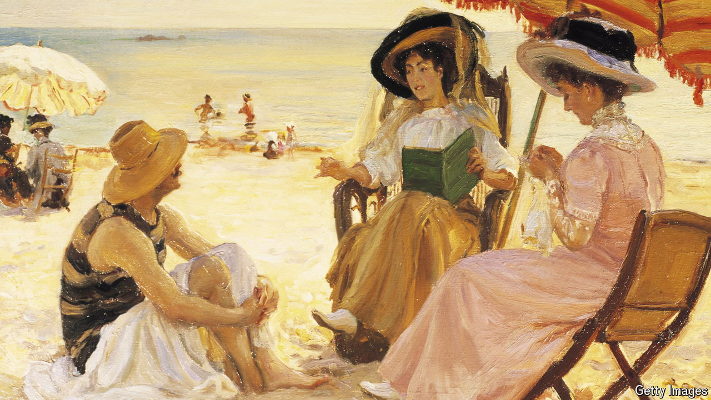

###### The Economist reads

# Six non-fiction books you can read in a day 

##### Resolved to read more? There may be no more rewarding genre than the short book 

 

> May 31st 2024 

THE SHORT book, long underestimated, has a lot going for it. To start with the prosaic: if you want to get through more volumes, short is shrewd. Slender books can be slipped into a bag or coat pocket and plucked out again in an idle moment, so you’ll be more likely to finish them. For adventurous readers the format allows for casual experimentation with new styles, topics and authors. For indecisive ones it can make a bookshop’s universe of possibilities feel less daunting: just scour the shelves for slim spines. Most of all, there is a rare satisfaction in reaching the final pages of a book while still holding the full sweep of its story in your mind. Taut prose is intense and immersive, like a distilled fragrance. These books offer that, too. They must; they don’t have long to make their point. In an era of many distractions, that is a great virtue.

These six non-fiction books include memoir, journalism, essays and pictorial essays. They take you into the bedroom of a grieving husband in imperial China; into the courtroom where a sensational murder trial split New York’s Bukharan Jewish community in the late 2000s; and, classically, into a room of one’s own. In short, they get plenty done in just 150 pages.

