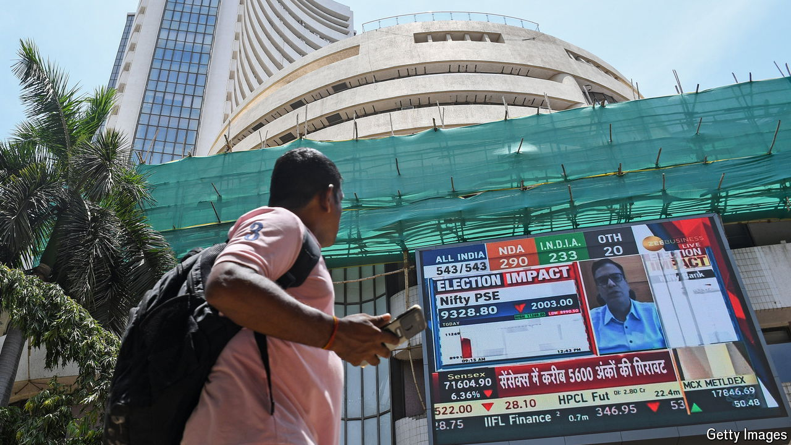
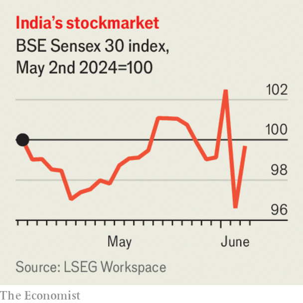

###### The world this week

# Business 

#####  

 

> Jun 6th 2024 

 


, which became the world’s fourth-largest earlier this year, swung wildly in the wake of a surprise election result that saw Narendra Modi’s Bharatiya Janata Party lose its majority. Having reached a record high after exit polls forecast a landslide for the BJP, the benchmark BSE Sensex index fell by 6% once the results were announced. It recovered a little the next day. The prices of shares in companies owned by Gautam Adani, a close associate of Mr Modi, were especially hard hit.

