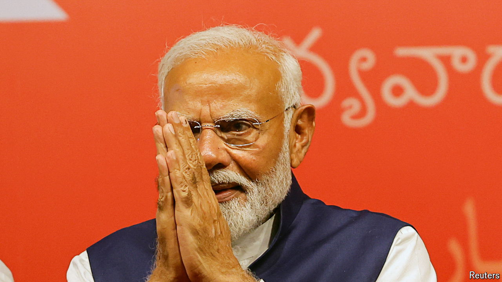

###### The world this week

# Politics 

#####  

 

> Jun 6th 2024 

 looks likely to serve a third term as India’s prime minister, after his Bharatiya Janata Party and its allies won a slim majority. The ruling alliance won 293 seats, compared with the opposition’s 234. Mr Modi had claimed that they would win upwards of 400 seats. The BJP itself lost 63 seats compared with the last election in 2019. 

Imran Khan, a former prime minister of , was acquitted of leaking state secrets in a ruling by the high court in Islamabad. The former cricketer will remain in jail for a separate conviction. He is appealing the case.

