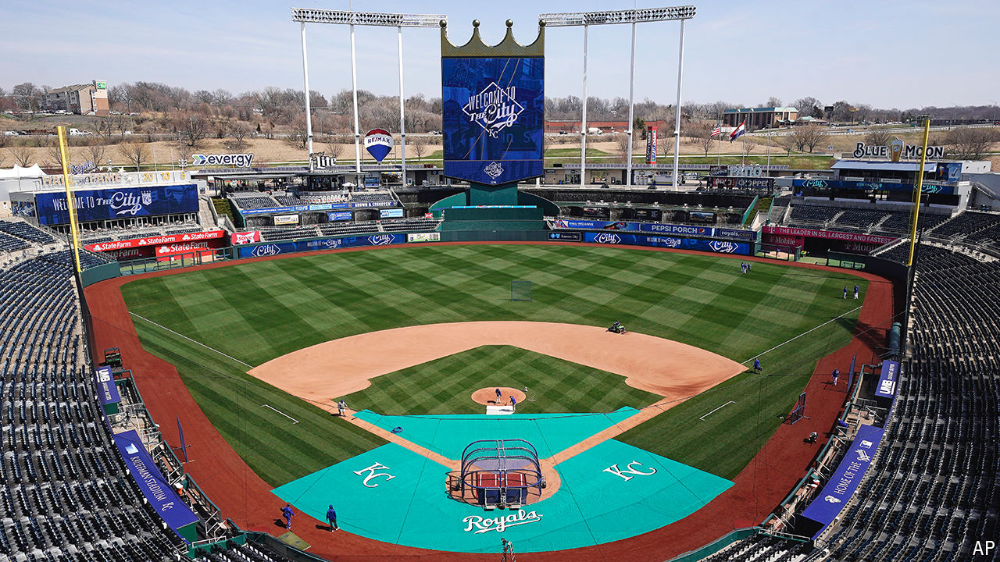

###### Fields of dreams

# A new wave of stadium-building is busting budgets in America 

##### The economics of ballparks are lousy, but politicians can’t resist subsidising them 

 

> Jun 3rd 2024 

On a summer evening in Kansas City, Kauffman Stadium is a fine place to be. A good game and $1 hot dogs await the 15,000 fans there to see the city’s major-league baseball team, the Royals. Before play begins, some mill about in the parking lot, drinking tallboys from the back of trucks. But amid the bonhomie is an undercurrent of worry. In April nearly 60% of local residents rejected a sales tax that would have helped pay for a new ballpark. Now there is a chance that the Royals might pick up their bats and go elsewhere. “If it stopped them from leaving, I’d take the tax,” says Daniel Capp, a lifelong fan.

The devotee’s worry—the loss of a beloved team—is easy to understand. From a national perspective, the worry is different. Whether the Royals end up staying in Missouri or moving, one outcome seems all but assured: taxpayers somewhere will end up footing much of the bill for their new stadium. Virtually every new professional-sports venue in America is built with public funds. And the subsidies are only growing, even as evidence piles up that they are almost always lousy investments.

