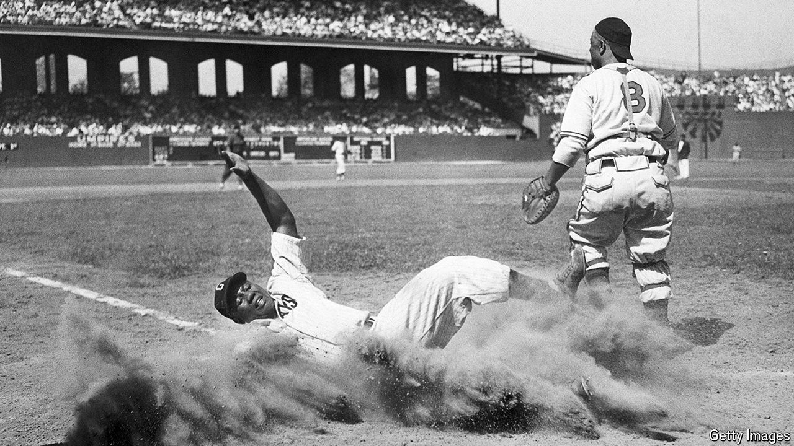

###### Home, at last

# Black baseball players of yore get their due, at last 

##### Major League Baseball recognition puts Josh Gibson ahead of Ty Cobb and Babe Ruth in the record books 

 

> Jun 6th 2024 

“GREAT NEGRO-LEAGUE stars have stood on those very grounds,” says Bob Kendrick, head of the Negro Leagues Baseball Museum at Hinchliffe Stadium in Paterson, New Jersey. “It just hits you.” Hinchliffe was once home to the New York Black Yankees, among others. Black and brown athletes played there when Major League Baseball (MLB) did not allow them to do so alongside white players. Visiting legends like Josh Gibson, often called the “Black Babe Ruth”, wowed fans.

Last week MLB acknowledged the statistics of more than 2,300 players who competed in the Negro Leagues between 1920 and 1948. That changed some long-held records. Gibson is now the leader in all-time career batting average and slugging percentage, overtaking Ty Cobb and Ruth.

