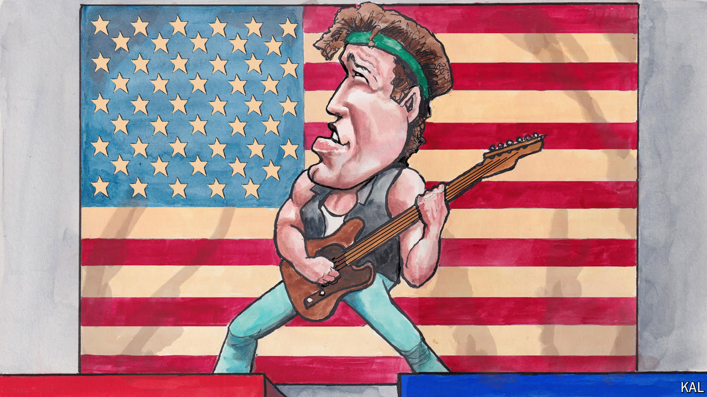

###### Lexington

# Grown up in the USA 

##### Forty years on, Bruce Springsteen’s defining album still has something to teach Americans 

 

> Jun 6th 2024 

The physical and psychic wounds of war, the hollowing-out of factory towns, the fear gnawing at working-class white men that their glory days are past: “Born in the USA”, the album that made Bruce Springsteen the global bard of the American project, came out 40 years ago this month, but it could as aptly describe the America of today, when polls suggest just about everyone feels like a rider on a downbound train.

What seems old-fashioned is the partisan ambiguity of Mr Springsteen’s messages and, with it, the stubborn hope. The title track in particular is remembered for being misunderstood by Republicans, who celebrated the music as patriotic without understanding its anguish and wrath. From the vantage of today, that takeaway is itself simplifying. It neglects some considerations.

