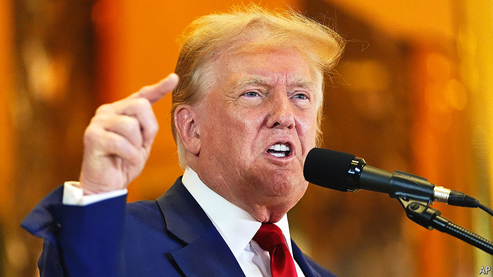

###### Motive and intent

# What Donald Trump’s 34 convictions mean for the presidential election 

##### Come election season, it could be Hunter Biden’s trial that hogs the headlines 

 

> Jun 6th 2024 

Donald Trump’s date with Manhattan Criminal Court is not over yet. Next comes his punishment for  in the first degree. In days or weeks Mr Trump will sit for an interview with a probation officer, a ritual that informs every sentence. Routine questions will be put to him. How are his health and home life? Describe friends and associates—are any, by chance, gang members? Then the kicker: does the defendant take responsibility for his crimes? 

The short, polite answer is absolutely not. To no one’s surprise Mr Trump assailed the verdict that came down on May 30th, as did practically every Republican with ambition. In lockstep they  as a rigged show-trial and as election interference by a Democratic district attorney, Alvin Bragg, whom House Republicans now want to haul before Congress. “Anyone who defends this verdict is a danger to you and your family,” said Tucker Carlson, a right-wing commentator. Donations to the Trump campaign surged. WinRed, a Republican fundraising site, briefly crashed.

