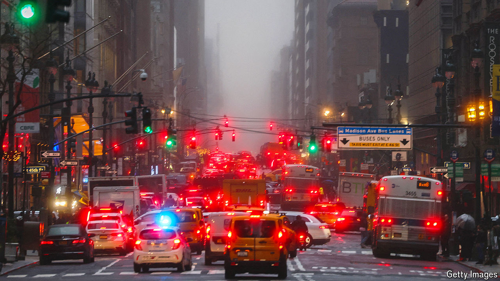

###### Jam today

# Why New York scrapped congestion charging 

##### Back-seat drivers may have influenced Governor Kathy Hochul’s abrupt decision 

 

> Jun 6th 2024 

AFTER years of false starts, and multiple lawsuits, it seemed congestion pricing at last had the green light in New York City. The cameras and other equipment were in place. Drivers of cars entering Manhattan’s central business district would have to pay $15. The money would pay for capital improvements in the subway. But on June 5th Kathy Hochul, New York’s Democratic governor, announced that the plan was “indefinitely pause[d]”. 

Her explanation for slamming on the brakes was weak. She claimed that “circumstances have changed” and that $15 “can break the budget of a working- or middle-class household”. But the city’s economy has improved and the $15 fee has been in the works since last year. So why did she change her mind? 

