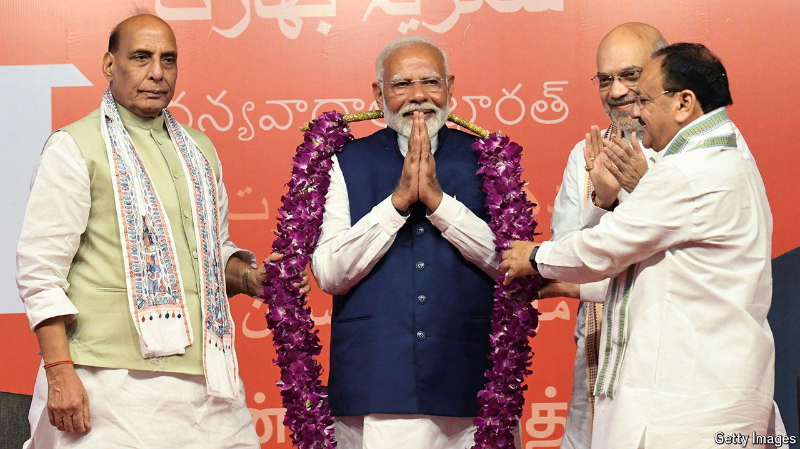

###### Modi’s new normal

# How will India’s new coalition government work? 

##### Narendra Modi’s cabinet signals continuity, but may soon face unfamiliar difficulties 

 

> Jun 13th 2024 

OBSERVING THE string of familiar faces taking the ministerial oath at the president’s residence in Delhi on June 9th, it was easy to forget that Narendra Modi’s Bharatiya Janata Party (BJP) had just suffered the loss of its majority in a general election. For all the talk of compromise needed to run a coalition government, Mr Modi appeared keen to demonstrate that there would be no change in who called the shots. Yet the picture obscures several new challenges for India’s prime minister. His immediate task is to satisfy a set of demanding coalition partners in the National Democratic Alliance (NDA). He will also have to grapple with a revived opposition and a disappointed base. 

The new Modi government looks a lot like the old one. The key postings are unchanged. Amit Shah, Mr Modi’s feared right-hand man, continues as home minister. Subrahmanyam Jaishankar keeps the Ministry of External Affairs, Rajnath Singh stays on as defence minister and Nirmala Sitharaman returns as finance minister. 

