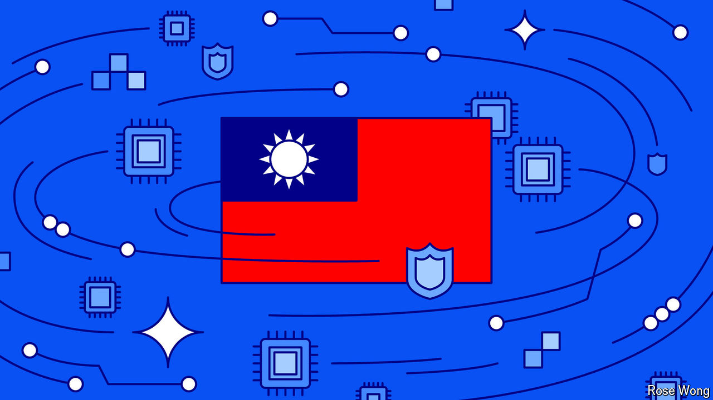

###### Taiwan, war and technology

# The semiconductor choke-point 

##### The world wants to rely less on Taiwanese chips. The island has other plans 

 

> Jun 13th 2024 

Taiwan and its semiconductor industry are one of the biggest choke-points in the world economy. Everything from phones to artificial intelligence (AI) models relies on the chips that Taiwan excels at making. Yet the island, which is self-governing but claimed by China, would be at the heart of any Sino-American war. Its chip fabrication plants (fabs) could be destroyed or their output embargoed, with huge knock-on effects across the planet. This danger explains why America, China, Japan and others have been subsidising the production of chips elsewhere.

Diversification makes sense for everyone—except Taiwan. For the island it is an economic threat and a security one. A smaller industry would make Taiwan poorer and strategically less important, which might make the West care less if China invaded it, and make it easier for China to do so without risking its chip supply. As a result, even as Western politicians and bosses boast of making chips at home, Taiwan is now working furiously to remain indispensable. “The first priority is Taiwan, the second priority is Taiwan, and the third priority is Taiwan,” C.C. Wei, the boss of tsmc, the leading firm, told investors on June 4th. In his inauguration speech on May 20th, Lai Ching-te, Taiwan’s new president, called it a “Silicon Island” and vowed it would work to secure a lead in AI. 

