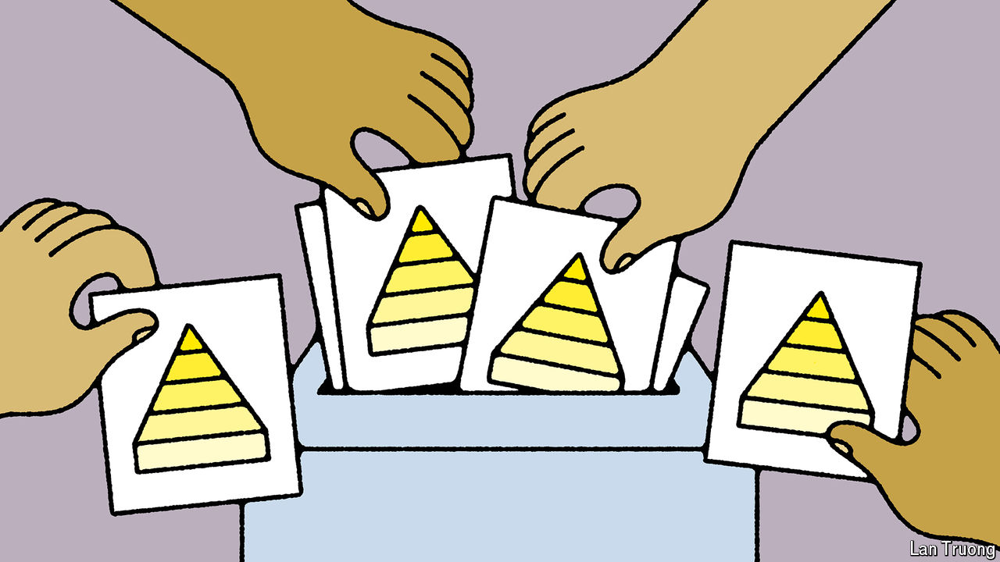

###### Banyan

# Why caste still matters in Indian politics 

##### Narendra Modi must rethink his approach to Hinduism’s social hierarchy 

 

> Jun 13th 2024 

Narendra Modi, India’s prime minister, made several costly miscalculations in this year’s general election. He overestimated his own popularity. He underestimated the extent of economic angst, especially about under-employment and inflation. And he relied excessively on Hindu nationalism to mobilise voters from the nation’s religious majority. But perhaps his most telling error was to mishandle what is still the most important fault line in Indian society: caste. 

Mr Modi’s Bharatiya Janata Party (BJP) ran a campaign that sought to unite every tier of Hinduism’s centuries-old caste system, under which adherents are ranked by birth in a strict hierarchy, with Brahmins (the priestly caste) at the top and Dalits (formerly known as untouchables) at the bottom. Although a system of quotas has for decades given lower castes preferential access to education, government jobs and some parliamentary seats, discrimination against them is endemic and often violent. 

