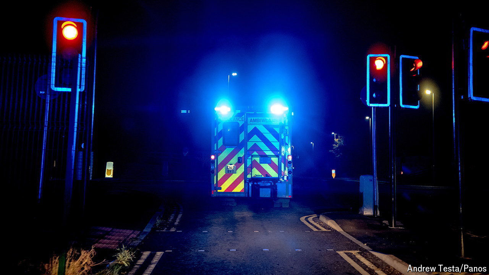

###### Testing times

# Britain’s NHS reels from a ransomware attack 

##### An assault on a health-care provider prompts an urgent call for blood donations 

 

> Jun 13th 2024 

The threat of ransomware, the process of stealing or encrypting data for the purposes of extortion, is increasingly obvious. In Britain in recent years local councils, water companies and a supplier to the Ministry of Defence have all been attacked by criminal gangs. Last year the website and other online services at the British Library went down as a result of a cyber-attack; the outage is still not fixed. On June 3rd  came for the National Health Service (NHS).

The attack has been attributed to Qilin, a Russian criminal group; the British government appears to have hit back by taking down the gang’s dark-web site. Qilin’s assault targeted the IT systems of Synnovis, a health-care firm that processes around 100,000 blood tests per day, rendering its data unusable. Several hospital trusts—including two London teaching hospitals, Guy’s and St Thomas’, and King’s College Hospital—have been affected by the attack. So have primary-care providers in six London boroughs.

