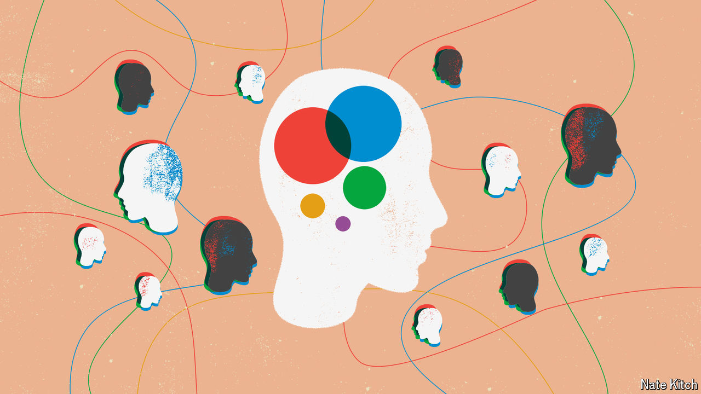

###### Ethnicity and politics

# In search of the white British voter 

##### The most important ethnic group in British politics is the one nobody talks about 

 

> Jun 7th 2024 

You would get a strange impression of Britain if you only watched the . For one thing, the country would appear to consist mainly of towns and suburbs. Party leaders trundle through pretty cathedral cities like Chichester and Winchester, commuter towns such as Bury and Harpenden, and seaside spots like Brighton, Lancing and St Ives. Few people—or, at least, few people worth visiting—seem to live in big cities.

Britain would also appear to be an overwhelmingly white country. The most recent censuses of England, Wales and Scotland, taken in 2021 and 2022, show that in 140 constituencies out of 632, white Britons account for less than two-thirds of the population (ethnic categories are different in Northern Ireland). Tallies by Sky News and PA Media show that the Conservative, Labour and Liberal Democrat leaders managed to visit just four of them in the first two weeks of the campaign. If they had picked constituencies at random, they would have hit twice as many. 

