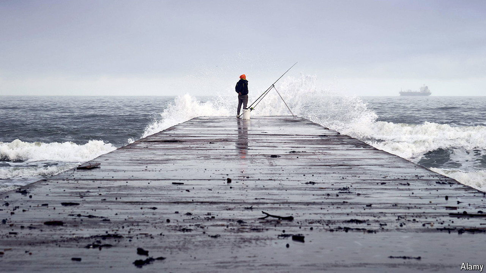

###### Blue rinse

# Our constituency poll has awful news for Britain’s Tories 

##### Hartlepool is on track to lurch back to Labour in the election. Reform UK is in second spot 

 

> Jun 11th 2024 

For a place that is often described as left behind, Teesside receives a lot of attention from politicians. The , a local paper, tallied over ten visits by Boris Johnson between 2019 and 2022, when he was prime minister. His successor-but-one, Rishi Sunak, has pointed at potholes in nearby Darlington and opened a branch of the Treasury there. On June 1st Mr Sunak launched the Tories’ “battle bus” in Redcar, east of the river Tees. 

One reason a region containing just 1% of Britain’s people gets so much notice is what happened in Hartlepool, a former shipbuilding town fallen on hard times, in May 2021. After the Labour mp suddenly resigned, the Conservative Party managed to —a rare case of a governing party doing better in a by-election than it had in the previous general election. Sir Keir Starmer, Labour’s leader, considered resigning. That turned out to be the high-water mark for Tory fortunes. 

