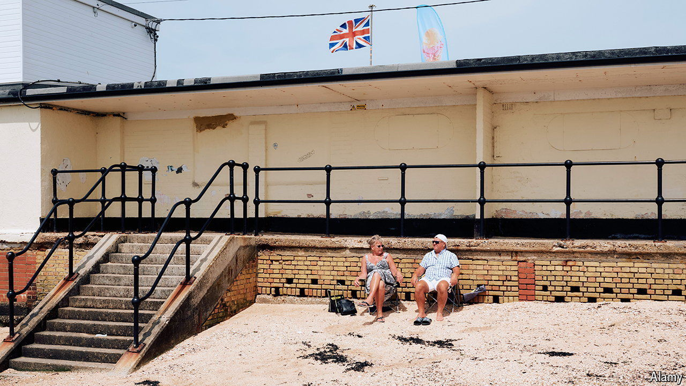

###### Canvey Island

# The most Tory place in Britain 

##### It isn’t that posh but its population is old 

 

> Jun 10th 2024 

Picture the most Tory place in Britain. Very probably you are thinking of a squires-and-shires sort of place—where lawns sweep and wisteria creeps; where old stone has been buffed up by new money; and where the people have Hunter wellies and hunting sympathies. The sort of place, in short, where someone might be murdered picturesquely in a Sunday evening mini-series. 

You would be wrong. To find the most Conservative spot in the country, don’t look west to the shires. Instead, step on a train from London’s Fenchurch Street station, a place of inexplicable importance to the Monopoly board and rather less importance to the metropolis. From there, travel east past places which lack wellies and pretensions—past Pitsea and Fobbing and Mucking—and just before the train line runs out, and a little before England does, you are there. This is Canvey Island. 

